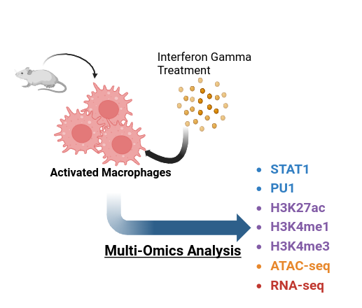

# Meta Analysis of Macrophage Datasets

<!-- badges: start -->

<!-- badges: end -->

The goal of this study is the identification of STAT1-dependent gene signatures in Macrophage inflammatory Responses. To achieve this, relevant datasets including Chip-seq, ATAC-seq and RNA-seq from GEO repository are collected, analyzed and integrated. This provides an integrative gene list involved in inflammatory response.

